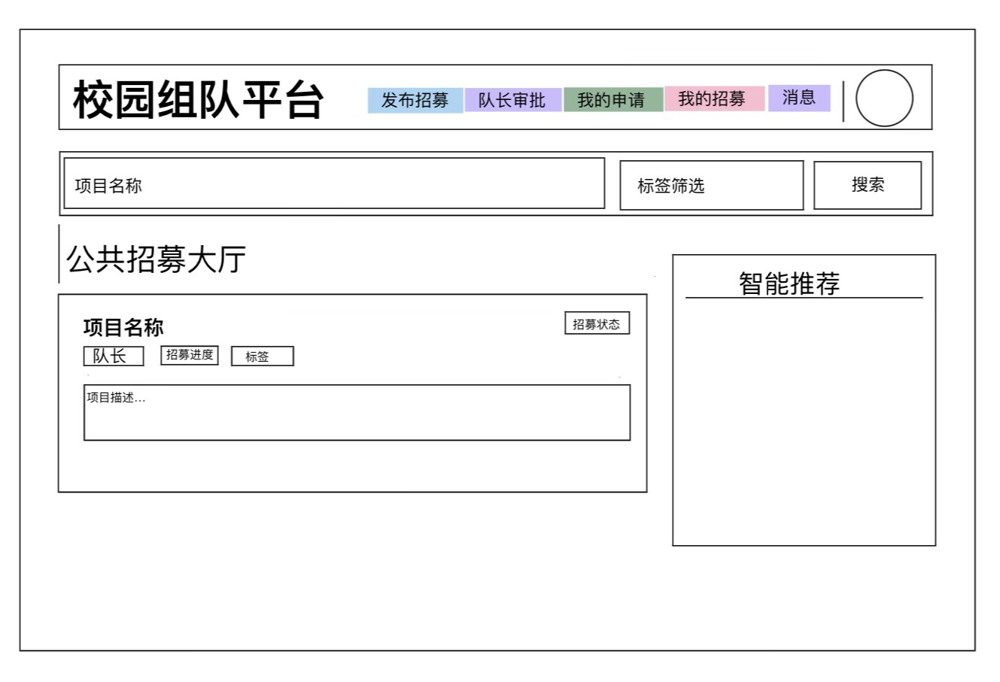

# 校园组队平台 - 界面设计说明

## 1. 用户登录界面

### 设计理由
1. 极简聚焦，降低用户决策成本：页面仅保留账号、密码、登录按钮三个核心元素，无多余干扰信息，用户可快速定位操作入口。
2. 场景适配，贴合校园用户习惯：账号字段与后续注册界面的「学号」字段统一，既符合校园平台的身份校验逻辑，也减少用户记忆负担。
3. 视觉居中，适配多终端：登录框居中布局，在不同屏幕尺寸下均能保证操作入口的清晰可见，提升使用体验。

---

## 2. 新用户注册界面

### 设计理由
1. 字段设计，兼顾身份校验与隐私保护：
   学号：作为校园平台的核心身份凭证，用于账号唯一标识与后续权限校验。
   昵称：保护用户真实隐私，组队协作时无需暴露个人信息。
   手机号码：用于后续密码找回、组队通知与消息提醒，保障协作沟通顺畅。
   密码+确认密码：双重校验机制，避免用户输入错误，保障账号安全。
2. 操作流程，减少冗余步骤：「注册并登录」按钮直接完成注册+登录的连贯操作，无需重复跳转登录页；「返回登录」按钮为已有用户提供快速退出路径。
3. 垂直表单布局，符合用户操作习惯：输入框从上到下按填写顺序排列，与用户阅读、输入逻辑一致，降低操作成本。

---

## 3. 公共招募大厅主界面

### 设计理由
1.  采用顶部导航+核心功能区+侧边栏的整体布局，结构清晰，符合用户使用习惯
2.  顶部导航集中高频功能入口，覆盖「发布招募/队长审批/我的申请/我的招募/消息」等组队全流程操作，同时将账号操作（修改密码/退出）集中布局，兼顾便捷性与安全性
3.  核心区以「公共招募大厅」为主视觉，突出“找项目组队”的核心场景
4.  侧边栏设置个人信息与智能推荐模块，兼顾用户状态查看与个性化匹配需求
5.  提供项目名称搜索+标签筛选功能，解决信息杂乱问题，帮助用户快速定位目标项目
6.  项目卡片关键信息（项目名称、队长、招募进度、状态、标签）前置，用户无需进入详情页即可快速判断匹配度，减少无效浏览
7.  预留智能推荐扩展空间，后续可基于用户标签与行为数据实现精准匹配，提升组队效率
8.  采用轻量化设计，适配校园网环境与学生碎片化使用场景，降低加载成本与认知成本
---

## 4. 个人资料编辑界面设计

### 设计理由
1. 将个人基础信息、拓展信息分区排版，填写顺序贴合用户日常填写逻辑，操作流畅不繁琐。
2. 区分必填项与选填项，减少用户初次使用的填写压力，提升使用体验。
3. 单独设置个人荣誉、技能标签填写板块，直观展示个人能力特长，提升组队匹配效率。
4. 弹窗式设计简洁轻便，无需跳转新页面，简单直观即可完成资料编辑修改。

---

## 5. 发布组队招募界面设计

### 设计理由
1. 输入内容按照项目发布逻辑依次排列，从项目基础信息、人数设置、标签分类到项目描述，符合用户操作思维。
2. 明确区分招募总人数、当前已有人数，组队进度一目了然。
3. 独立的文本描述输入区域，可完整填写项目要求、组队需求，信息填写完整规范。
4. 弹窗化交互设计，操作便捷，发布完成直接返回主页面，流程简单顺畅。

---

## 6.申请审批管理界面设计

### 设计理由
1. 统一展示所有组队申请记录，申请人信息、申请项目全部清晰展示。
2. 划分待审核、已处理两种状态，内容区分明确，方便队长查看分辨。
3. 搭配同意、拒绝、删除记录操作按钮，审核流程简单直接，管理方便。

---

## 7. 修改密码界面

### 设计理由
1. 整体采用简约整洁的表单垂直布局，排版规整有序，功能分区清晰，用户可按顺序依次填写信息，操作简单易懂。
2. 设置原密码、新密码、确认新密码输入框，规范密码修改流程，双重校验新密码，避免输入错误，有效保障用户账号安全。
3. 页面无多余繁杂装饰，界面干净清爽，交互逻辑简单直白，适配校园管理系统的使用风格，新手也能快速上手操作。

---

## 8. 我的申请记录界面

### 设计理由
1. 采用列表样式展示所有项目申请内容，清晰展示项目名称与审核进度状态，用户可以直观查看申请结果，实时掌握审核情况。
2. 搭配撤销申请功能按钮，用户遇到误提交、临时放弃参与项目的情况，可自主一键撤销申请，操作灵活便捷。
3. 页面布局简洁统一，记录排列整齐，方便用户快速浏览、查找过往申请记录，页面观感舒适，浏览体验良好。

---

## 9. 我的招募管理界面

### 设计理由
1. 采用独立卡片式布局展示发布的项目，每个项目单独分区，界限分明，不会出现内容混淆，避免操作误触。
2. 卡片内直接展示招募人数、项目招募状态等核心信息，无需跳转详情页，就能快速查看项目进度，提升管理效率。
3. 区分招募中、已截止两种项目状态，搭配对应的操作功能按钮，支持停止招募、开放招募、隐藏、删除等操作，满足项目全周期管理需求。

---

## 10. 消息聊天会话页面

### 设计理由
1.  整体采用三栏式布局，清晰划分会话列表、聊天主区与成员面板三大功能模块，信息层级明确，符合即时通讯场景的使用逻辑。
2.  左侧会话列表模块，支持多会话快速切换，适配高频聊天场景，降低用户切换会话的操作成本。
3.  中间聊天主区作为核心交互区域，包含消息流展示与底部固定输入框；消息按发送方区分左右对齐，提升阅读效率与交互体验。
4.  右侧成员面板并行展示会话成员信息，用户无需跳转即可查看，兼顾信息获取效率与聊天主区的视觉聚焦。
5.  整体遵循即时通讯产品的通用交互范式，用户上手成本低，布局清晰且具备良好的功能扩展性。
---

## 11. 消息通知提示页面

### 设计理由
#### 顶部「消息」入口 + 红点标记
1. 导航栏常驻入口，用户在任意页面均可快速触达消息中心
2. 红点标记是通用的未读消息符号，直观传递“有新消息”的状态，降低用户遗漏关键通知的概率
3. 与组队核心功能并列，体现消息在申请、审批流程中的高优先级
#### 右下角「新消息」弹窗
1. 采用非模态弹窗设计，不打断用户浏览招募大厅的主流程
2. 固定于页面右下角，不遮挡核心内容，符合用户网页端通知的使用习惯
3. 与顶部红点形成双重提醒，覆盖用户未关注导航栏的场景，进一步提升消息触达率
