# 校园组队招募系统 — 中期与结项报告

> **使用说明**
> - 本文档作为**中期检查**与**最终软件说明书**的共用主文档。
> - **中期阶段**：先完成标注为"中期必填"的内容；标注为"结项补全"的内容可暂留空。
> - **结项阶段**：在中期版本基础上继续补全，整理后导出为最终doc/docx。
> - 过程性图片请单独存放在`assets/`目录，正文中使用相对路径引用。
> - 过程考核以Git中的md增量记录为主，最终排版稿以导出的doc/docx为准。

---

## 基本信息

| 项目 | 内容 |
|-----|------|
| **项目名称** | 校园组队招募系统 |
| **学 院** | 计算机学院 |
| **小组序号** | 11 |
| **成员姓名** | 熊梓威 / 未小晴 / 曾淼 / 刘洺希 / 高梦 |
| **指导老师** | 尹兆远 |
| **当前版本** | 结项版 |
| **更新日期** | 2026年5月16日 |

---

## 一、项目概述 【中期必填】

### 1. 项目背景

本项目来源于当前大学生在竞赛、考研、求职、课程项目等场景下"找搭子难、组队效率低"的实际痛点。

现有微信群、QQ群、校园墙等方式存在以下问题：
- 信息分散，缺乏统一发布平台
- 缺乏精准筛选与匹配机制
- 跨班级、跨专业沟通渠道不畅
- 组队过程缺乏规范的审批与管理流程

本系统提供一个集中发布招募、精准匹配、在线沟通的平台，有效降低组队门槛，提高组队成功率。

### 2. 系统目标

- ✅ 提供统一组队平台，降低跨班级、跨专业组队门槛
- ✅ 基于技能/兴趣标签实现精准匹配与智能推荐
- ✅ 支持招募发布、申请审批、在线聊天与消息通知
- ✅ 保障多端互斥登录与数据安全
- ✅ 支持Markdown富文本排版，提升招募信息专业度

### 3. 开发环境

| 分类 | 技术选型 |
|-----|---------|
| **后端** | Python 3.13 + FastAPI + Uvicorn |
| **前端** | Jinja2 + HTML5/CSS3 + 原生JavaScript (Fetch API) |
| **数据库** | SQLite (轻量级，免配置) |
| **开发工具** | VS Code / PyCharm + Git |
| **依赖管理** | pip |

---

## 二、需求分析 【中期必填】

### 1. 功能需求

系统主要功能包括：

| 功能模块 | 说明 |
|---------|------|
| **注册登录** | 支持多端互斥登录，自动挤下线，保障账号安全 |
| **个人名片** | 首次登录强制完善资料，支持头像、专业、联系方式管理 |
| **技能/兴趣标签** | 用户自选标签；队长发布招募时可预设标签要求 |
| **招募大厅** | 发布/隐藏/删除招募，自动展示"招募中/已满员"状态，局部刷新 |
| **搜索筛选** | 按分类（竞赛/考研/求职/课程项目）、关键词、组合条件筛选 |
| **图文排版** | 招募详情支持Markdown，前端渲染为富文本 |
| **智能推荐** | 基于用户专业与标签，推荐高度契合项目 |
| **审批管理** | 用户提交申请，队长审批；队长可移出成员 |
| **消息红点** | 全局未读提醒 + 右下角弹窗通知 |
| **在线聊天** | 私聊 + 项目群聊，同意入队自动拉群，支持交换外部联系方式 |

### 2. 非功能需求

| 类别 | 要求 |
|-----|------|
| **性能要求** | 页面无感局部刷新，聊天消息延迟 ≤ 2秒 |
| **安全要求** | 密码加密存储（SHA-256）；多端互斥登录防账号共用 |
| **兼容性要求** | 支持主流现代浏览器（Chrome / Edge / Firefox） |
| **可靠性要求** | 数据持久化存储，支持断点续连 |

> 📌 **中期要求**：功能清单、主要业务流程、基本非功能需求应明确。
> 📌 **结项要求**：与最终实现保持一致，删除未完成但未说明的内容。

---

## 三、系统设计 【中期必填】

### 1. 系统架构

系统采用前后端分层架构：

```text
┌─────────────────────────────────────────┐
│           浏览器端                       │
│  Jinja2模板 + HTML/CSS/JS + FetchAPI    │
└─────────────────┬───────────────────────┘
                  │
          HTTP / WebSocket
                  │
┌─────────────────▼───────────────────────┐
│          FastAPI 后端                   │
│    RESTful接口 + WebSocket（聊天）      │
└─────────────────┬───────────────────────┘
                  │
┌─────────────────▼───────────────────────┐
│         SQLite 数据库                    │
└─────────────────────────────────────────┘
```

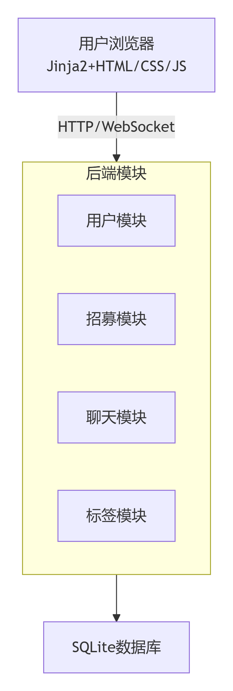


### 2. 模块设计

| 模块 | 功能说明 |
|-----|---------|
| **用户模块** | 注册/登录/互斥登录/个人资料管理 |
| **标签模块** | 技能/兴趣标签管理及匹配算法 |
| **招募模块** | 发布/编辑/隐藏/删除/状态更新 |
| **搜索推荐模块** | 多维度筛选 + 智能推荐逻辑 |
| **申请审批模块** | 入队申请、审批、成员管理 |
| **消息模块** | WebSocket聊天 + 未读红点 + 弹窗通知 |
| **群聊模块** | 自动创建项目群、成员同步管理 |

### 3. 数据库设计

#### E-R 图

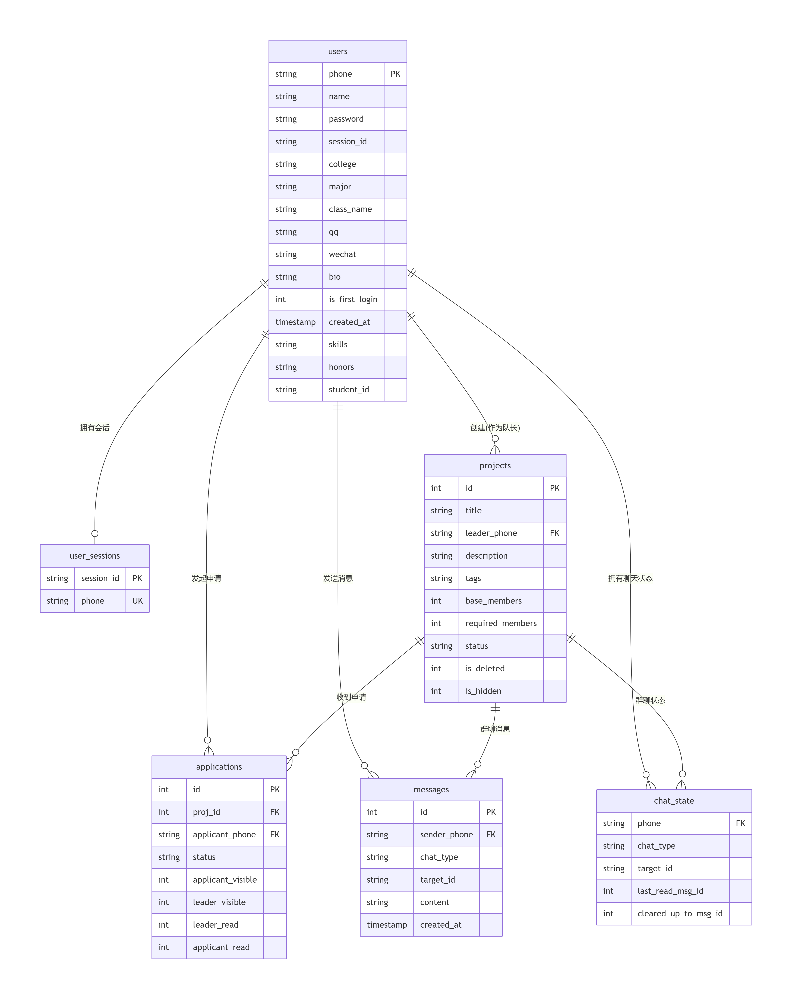

#### 主要数据表设计（核心表）

| 表名 | 说明 | 关键字段 |
|-----|------|---------|
| `users` | 用户表 | phone(主键), name, password, college, major, skills, session_id |
| `user_sessions` | 会话表 | session_id(主键), phone |
| `projects` | 招募项目表 | id(主键), title, leader_phone, description, tags, status |
| `applications` | 申请表 | id(主键), proj_id, applicant_phone, status |
| `messages` | 消息表 | id(主键), sender_phone, chat_type, target_id, content |
| `chat_state` | 聊天状态表 | phone, chat_type, target_id (联合主键) |

> 📌 **中期要求**：架构、模块、数据库设计基本定稿。
> 📌 **结项要求**：与最终系统一致，如有调整需同步更新。

---

## 四、系统实现

### 1. 关键技术

| 技术 | 应用场景 |
|------|----------|
| **FastAPI异步框架** | 构建RESTful API接口，支持异步请求处理与自动文档生成 |
| **SQLite轻量级数据库** | 数据持久化存储，免配置部署，支持多表关联查询 |
| **Session + Cookie会话管理** | 用户登录状态维护，生成唯一session_id存入cookie |
| **多端互斥登录** | 新设备登录时删除旧设备session，实现“顶号”强制下线 |
| **SHA256密码加密** | 用户密码存储前进行哈希加密，保障账号安全 |
| **轮询消息推送** | 前端每2.5秒轮询后端接口，实现消息实时通知与红点提醒 |
| **Markdown实时渲染** | 前端使用marked.js库将项目描述渲染为HTML |
| **Ajax异步表单提交** | 所有表单通过fetch API异步提交，无需刷新页面 |
| **智能推荐算法** | 基于用户技能标签与项目标签的模糊匹配（子串包含+大小写归一化） |

### 2. 界面展示

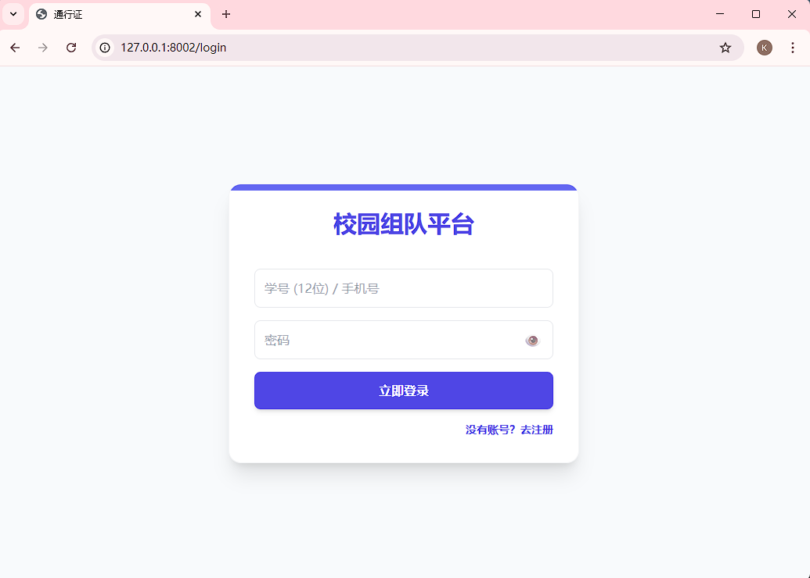

*图1：登录页面，支持学号/手机号两种登录方式*

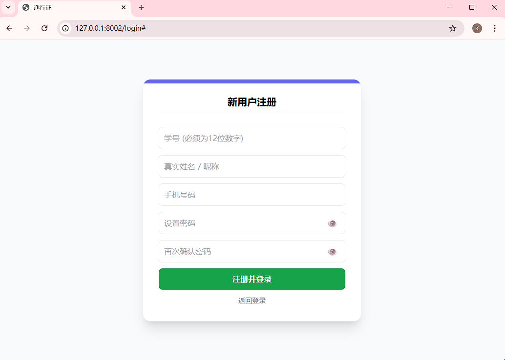

*图2：注册页面，需填写学号(12位)、姓名、手机号、密码*

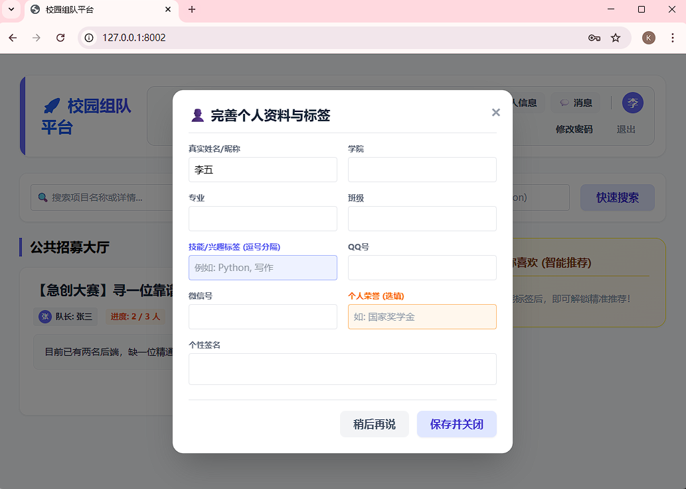

*图3：个人信息管理页面，填写技能标签用于智能推荐*

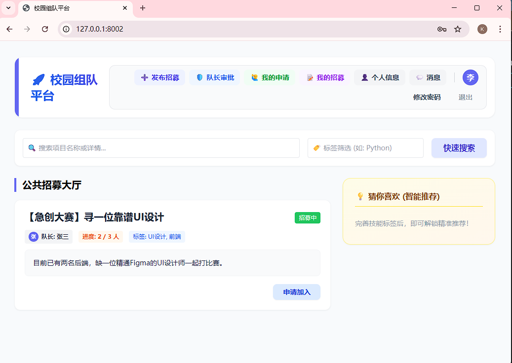

*图4：招募大厅主界面，左侧项目卡片，右侧智能推荐面板*

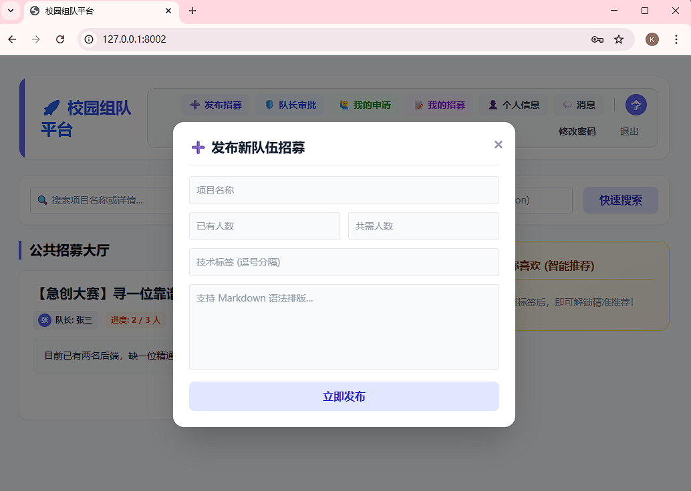

*图5：发布招募弹窗，支持Markdown描述*


*图6：队长审批弹窗，显示待审核成员及荣誉信息*


*图7：消息聊天页面，左侧会话列表，右侧聊天区域，群聊模式下显示成员面板*

### 3. 核心代码片段

**多端互斥登录（顶号）实现：**

```python
@app.post("/do_login")
async def do_login(username: str = Form(...), password: str = Form(...)):
    new_sess = generate_session_id()
    with sqlite3.connect(DB_FILE, timeout=10) as conn:
        user = conn.cursor().execute(
            "SELECT phone FROM users WHERE (phone=? OR student_id=?) AND password=?",
            (username, username, hash_password(password))
        ).fetchone()
        if user:
            phone = user[0]
            # 关键：删除该用户所有旧session，实现互斥登录
            conn.execute("DELETE FROM user_sessions WHERE phone = ?", (phone,))
            conn.execute("INSERT INTO user_sessions (session_id, phone) VALUES (?, ?)", (new_sess, phone))
            conn.commit()
            res = RedirectResponse(url="/", status_code=303)
            res.set_cookie("session_token", new_sess, max_age=604800)
            return res
        return alert_and_redirect("❌ 账号或密码错误！", "/login")
```

---

## 五、系统测试

### 1. 测试方案

| 项 | 说明 |
|----|------|
| **测试方法** | 前后对比手动测试（输入样例 → 验证页面响应） |
| **测试范围** | 注册、登录、个人信息管理、发布招募、项目可见性切换、申请加入、撤销申请、队长审批、招募隐藏/删除/停止、私聊、项目群聊、未读消息红点、消息管理、关键词搜索、标签筛选、智能推荐、顶号、信息保存（共18项） |
| **测试工具** | 浏览器开发者工具（截图对比）、后端日志（bug修复阶段） |

### 2. 测试用例（已执行）

| 用例ID | 测试项 | 预期结果 | 状态 |
|--------|--------|---------|------|
| TC-01 | 用户注册 | 点击“注册并登录”后成功进入系统 | ✅ 通过 |
| TC-02 | 用户登录 | 学号/手机号+密码登录成功 | ✅ 通过 |
| TC-03 | 个人信息管理 | 保存后个人信息正确显示 | ✅ 通过 |
| TC-04 | 发布招募 | 大厅正常显示发布的招募卡片 | ✅ 通过 |
| TC-05 | 项目可见性切换 | 另一账号能看到发布的项目 | ✅ 通过 |
| TC-06 | 申请加入 | 队长端收到申请通知 | ✅ 通过 |
| TC-07 | 撤销申请 | 申请状态恢复正常 | ✅ 通过 |
| TC-08 | 队长审批（同意/婉拒） | 同意后入队，婉拒后申请被拒 | ✅ 通过 |
| TC-09 | 隐藏招募 | 发布者显示“仅自己可见”，其他账号不可见 | ✅ 通过 |
| TC-10 | 停止招募 | 双方均显示“已满员/截止” | ✅ 通过 |
| TC-11 | 删除招募 | 双方均看不到被删除项目 | ✅ 通过 |
| TC-12 | 私聊功能 | 双方正常收到私聊消息 | ✅ 通过 |
| TC-13 | 项目群聊 | 双方正常收到群聊消息 | ✅ 通过 |
| TC-14 | 未读消息红点 | 有未读时红点显示，查看后消失 | ✅ 通过 |
| TC-15 | 消息管理（单向删除） | 删除后仅自己看不到，对方仍可见 | ✅ 通过 |
| TC-16 | 关键词搜索 | 能正确搜索到包含关键词的项目 | ✅ 通过 |
| TC-17 | 标签筛选 | 按标签筛选结果正确 | ✅ 通过 |
| TC-18 | 智能推荐 | 根据用户技能标签推荐匹配项目 | ✅ 通过（修复后） |
| TC-19 | 顶号测试 | 旧设备被强制下线并返回登录页 | ✅ 通过 |
| TC-20 | 信息保存（自动登录） | 关闭浏览器后重新打开，信息保留且自动登录 | ✅ 通过 |

### 3. 问题与改进（已修复）

| 问题编号 | 问题描述 | 状态 | 解决方案 |
|---------|---------|------|---------|
| **P-01** | 智能推荐算法初期匹配精准度低：用户标签为“Python”，应推荐“信息系统实践”和“计算机网络”两个项目，但实际只推荐了“计算机网络” | ✅ 已修复 | 1. 新增 `/api/poll_recommend` 轮询接口，基于游标对比机制实时推送新项目；2. 算法升级：废弃集合交集判断，改用子串模糊匹配（`if any(skill in proj_tags_str ...)`），支持大小写归一化；3. 修改大厅渲染逻辑，推荐分数改为子串包含计数；4. 前端每2.5秒轮询推荐接口，收到新项目时弹窗提示并局部刷新大厅面板；5. 移除本地 localStorage 游标，改由后端数据库统一控制 |

> 📌 **结项说明**：全部20个测试用例均通过验证，智能推荐问题已按上述方案完成修复并回归测试通过。

# 六、用户手册

## 1. 安装部署说明

### 1.1 环境要求

| 项目 | 要求 |
|------|------|
| 操作系统 | Windows / macOS / Linux |
| Python版本 | Python 3.8 及以上 |
| 数据库 | SQLite3（内置，无需额外安装） |
| 浏览器 | Chrome / Edge / Firefox（推荐最新版） |

### 1.2 部署步骤

**第一步：准备项目文件**

将以下文件放置于同一目录下：

- `main.py`（主程序文件）
- 程序运行后会自动生成 `campus_team_v11_clean.db`（数据库文件）

**第二步：安装依赖库**

打开终端（命令行），进入项目目录，执行以下命令：

```bash
pip install fastapi uvicorn
```

> 注：sqlite3 和 hashlib 为 Python 内置模块，无需额外安装。

**第三步：启动服务**

在终端中执行：

```bash
python main.py
```

启动成功后，控制台会显示：

=================================================== 🚀 校园组队系统启动成功！ 🌐 访问地址: http://127.0.0.1:8002


**第四步：访问系统**

打开浏览器，访问地址：`http://127.0.0.1:8002`

### 1.3 常见问题

| 问题 | 解决方法 |
|------|----------|
| 端口被占用 | 修改代码末尾的 `port=8002` 为其他端口（如 8080） |
| 无法连接数据库 | 检查当前目录是否有写入权限 |
| 页面样式异常 | 检查网络是否能访问 CDN（tailwindcss、marked.js） |

---

## 2. 操作指南

### 2.1 注册与登录

**注册账号**

1. 访问首页，点击"没有账号？去注册"
2. 填写：学号（12位数字）、姓名/昵称、手机号、密码
3. 点击"注册并登录"完成注册

**登录系统**

- 方式一：使用手机号 + 密码登录
- 方式二：使用学号（12位）+ 密码登录

**修改密码**

1. 点击大厅右上角"修改密码"按钮
2. 输入学号、手机号进行身份验证
3. 输入原密码和新密码，确认后提交

### 2.2 完善个人信息

1. 点击大厅右上角的"个人信息"按钮（或头像）
2. 填写以下信息（带 * 为必填）：
   - 学院、专业、班级
   - 技能/兴趣标签（如：Python，Java，前端），用于智能推荐
   - QQ号、微信号（方便组队联系）
   - 个人荣誉（如：国家奖学金）
   - 个性签名
3. 点击"保存并关闭"

> 💡 提示：技能标签填写越详细，智能推荐越精准！

### 2.3 发布招募项目

1. 点击大厅顶部的"➕ 发布招募"按钮
2. 填写项目信息：
   - 项目名称
   - 已有人数 / 共需人数
   - 技术标签（逗号分隔，如：Python，数据库）
   - 项目描述（支持 Markdown 语法）
3. 点击"立即发布"，项目将显示在公共招募大厅

### 2.4 管理我的招募

点击"📝 我的招募"按钮

对每个项目可执行以下操作：

| 操作 | 说明 |
|------|------|
| 隐藏招募 | 仅自己可见，其他人看不到此项目 |
| 停止招募 | 项目状态变为"已满员/截止"，不可再申请 |
| 删除招募 | 永久删除项目（不可恢复） |

### 2.5 申请加入项目

1. 在公共招募大厅浏览项目
2. 点击项目卡片中的"申请加入"按钮
3. 队长审批前可点击"我的申请"中的"撤销申请"取消

### 2.6 队长审批申请

1. 点击"🛡️ 队长审批"按钮
2. 查看待审核成员列表，可看到申请者的荣誉信息
3. 选择"同意进组"或"婉拒"
4. 审批后，申请记录会保留在历史中
5. 当队伍满员时，项目状态自动变为"已截止"

### 2.7 消息聊天

**私聊功能**

1. 在大厅点击任意用户的头像
2. 点击"💬 发起聊天"
3. 输入消息后发送

**项目群聊**

- 入队成功后，可通过"我的申请"或项目卡片进入群聊
- 群聊内所有队员和队长均可收发消息
- 队长可在右侧成员面板中"移出"队员

**消息管理**

- 未读消息会在"消息"按钮和对应会话上显示红点
- 点击会话列表右侧的"🗑️"按钮可清空聊天记录（仅自己不可见）

### 2.8 搜索与推荐

**关键词搜索**

在搜索框中输入项目名称或描述关键词，点击"快速搜索"

**标签筛选**

在标签筛选框中输入标签（如：Python），按标签过滤项目

**智能推荐**

- 系统根据您填写的"技能/兴趣标签"自动匹配推荐项目
- 推荐结果显示在右侧"猜你喜欢"面板
- 匹配度越高，排名越靠前

### 2.9 退出与多端互斥

- 点击"退出"按钮安全登出
- 同一账号在另一设备登录时，原设备会被强制下线并弹出提示

---

## 3. 界面速查表

| 功能入口 | 位置 | 说明 |
|----------|------|------|
| 发布招募 | 顶部导航栏 | 创建新项目 |
| 队长审批 | 顶部导航栏 | 审核入队申请 |
| 我的申请 | 顶部导航栏 | 查看申请记录 |
| 我的招募 | 顶部导航栏 | 管理已发布项目 |
| 个人信息 | 顶部导航栏 / 头像 | 编辑个人资料 |
| 修改密码 | 顶部导航栏 | 更改登录密码 |
| 消息 | 顶部导航栏 | 进入聊天界面 |
| 退出 | 顶部导航栏 | 安全登出 |
| 搜索/筛选 | 大厅搜索栏 | 查找项目 |
| 申请加入 | 项目卡片 | 向队长发起入队申请 |
| 发起聊天 | 用户头像弹窗 | 私聊其他用户 |

---

> 📌 **技术支持**：如遇系统问题，请联系开发团队。

## 七、项目总结

### 1. 成果总结（结项版）

截至 **2026年5月16日**，项目已完成全部核心功能开发与测试，具体如下：

**已完成功能（共18项，全部通过测试）：**

| 模块 | 功能 | 状态 |
|------|------|------|
| 账号与权限 | 用户注册 | ✅ 完成 |
| 账号与权限 | 用户登录（学号/手机号） | ✅ 完成 |
| 账号与权限 | 个人信息管理 | ✅ 完成 |
| 账号与权限 | 多端互斥登录（顶号） | ✅ 完成 |
| 账号与权限 | 信息保存与自动登录 | ✅ 完成 |
| 招募项目管理 | 发布招募 | ✅ 完成 |
| 招募项目管理 | 项目可见性切换（隐藏/取消隐藏） | ✅ 完成 |
| 招募项目管理 | 停止招募/重新开放 | ✅ 完成 |
| 招募项目管理 | 删除招募 | ✅ 完成 |
| 组队申请流 | 申请加入 | ✅ 完成 |
| 组队申请流 | 撤销申请 | ✅ 完成 |
| 组队申请流 | 队长审批（同意/婉拒） | ✅ 完成 |
| 即时通讯系统 | 私聊功能 | ✅ 完成 |
| 即时通讯系统 | 项目群聊 | ✅ 完成 |
| 即时通讯系统 | 未读消息红点 | ✅ 完成 |
| 即时通讯系统 | 消息管理（单向删除） | ✅ 完成 |
| 搜索与推荐 | 关键词搜索 | ✅ 完成 |
| 搜索与推荐 | 标签筛选 | ✅ 完成 |
| 搜索与推荐 | 智能推荐 | ✅ 完成（已修复） |

**主要技术成果：**

1. **智能推荐算法优化**：从集合交集匹配升级为子串模糊匹配（大小写归一化），支持实时轮询推送新项目
2. **消息系统**：支持私聊和群聊，含未读红点、单向清空记录等功能
3. **安全机制**：密码SHA256加密存储、会话管理、顶号强制下线
4. **用户体验**：Markdown支持、Toast通知、自动登录、响应式布局

**代码统计（最终版）：**

- 后端文件：1个核心文件（`main.py`），约 1,200 行代码
- 前端代码：内嵌于后端，约 800 行 HTML/JS
- 数据库表：7张（users, user_sessions, projects, applications, messages, chat_state）
- Git提交次数：共 145 次，人均约 29 次

---

### 2. 不足与改进方向（已完成与待优化）

| 不足 | 处理状态 | 改进措施 |
|------|----------|----------|
| 智能推荐精准度低 | ✅ 已修复 | 改为子串模糊匹配 + 实时轮询推送 |
| 推荐算法初期只推荐1个项目 | ✅ 已修复 | 增加实时轮询接口 `/api/poll_recommend` |
| 消息系统离线处理 | ⏳ 后续优化 | 计划增加消息离线推送机制 |
| 前端移动端适配 | ⏳ 后续优化 | 计划增加响应式布局优化 |
| 单元测试覆盖率 | ⏳ 后续优化 | 计划增加 pytest 单元测试，目标覆盖率 ≥80% |
| 群聊自动拉群边缘情况 | ✅ 已完成 | 申请通过后自动加入群聊，成员可被移出 |

---

### 3. 成员分工表

| 姓名 | 班级 | 学号 | Git账号 | 主要任务 |
|------|------|------|---------|----------|
| 熊梓威 | 计科2班 | 202405567129 | xiongziwei060523 |统筹团队分工与进度；项目文档编写，测试结果的截图整理与上传工作、负责数据库表结构设计。 |
| 未小晴 | 计科2班 | 202405567103 | WQmjq |负责系统前端开发，完成全页面布局、样式美化、交互逻辑与接口对接。|
| 曾淼 | 计科2班 | 202405567109 | zengmiaocas | 后端代码，数据库代码以及字段说明文件，测试，main，README|
| 刘洺希 | 计科2班 | 202405567101 | Lmx102206 | 负责校园组队平台全部功能的设计编写工作，包括基础框架、数据库设计、接口规范等六份核心文档。 |
| 高梦 | 计科2班 | 202405567134 | qqw-23 | 负责校园组队系统界面设计与设计文档编写工作，记录页面布局样式与设计理由。|

---

### 4. Git 提交记录

**提交统计（最终版）：**

| 成员 | 提交次数 | 主要贡献 |
|------|----------|----------|
| 熊梓威 | 47 | 统筹团队分工与进度；项目文档编写，测试结果的截图整理与上传工作、负责数据库表结构设计。 |
| 未小晴 | 15 | 实现前端页面开发、样式美化、交互逻辑与前后端联调，修复前端问题。 |
| 曾淼 | 48 |后端代码，数据库代码以及字段说明文件，测试，main，README |
| 刘洺希 | 12 | 完成了登录注册、个人名片、招募大厅、搜索审批、在线聊天、实时消息通知等模块的详细设计文档，明确接口逻辑与实现要点。 |
| 高梦 | 23 | 完成招募大厅、发布招募、管理招募、审批申请、消息会话等页面设计，撰写界面设计相关文档。|

**提交记录截图：**

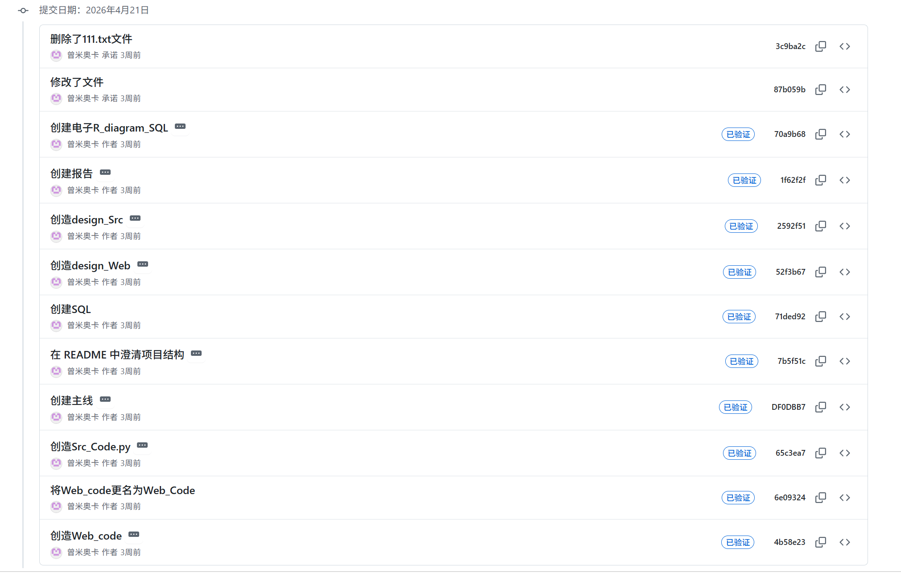

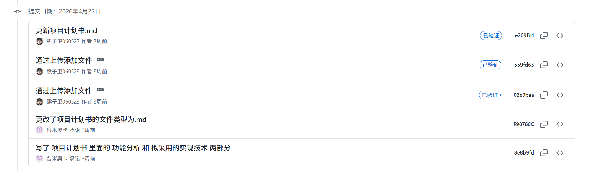

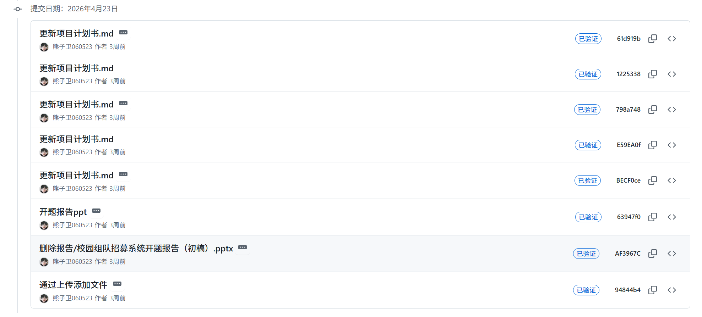

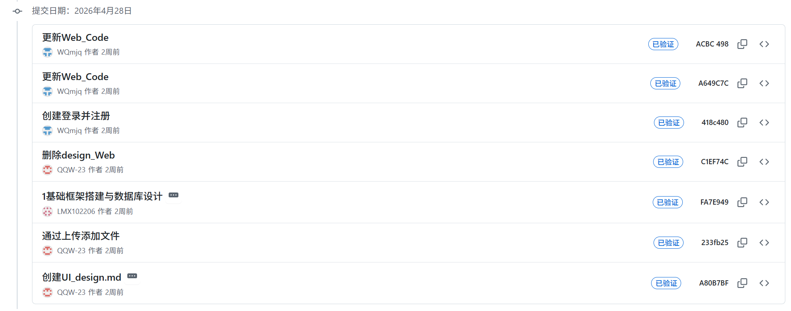

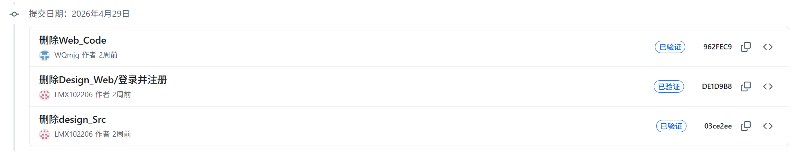

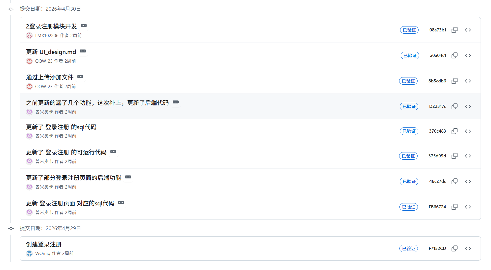

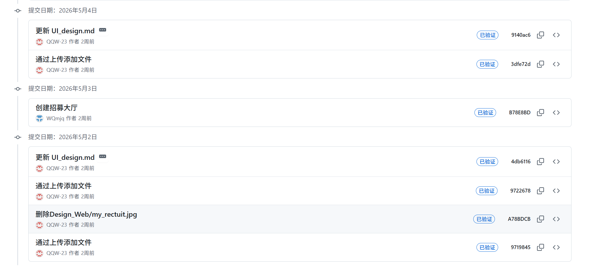

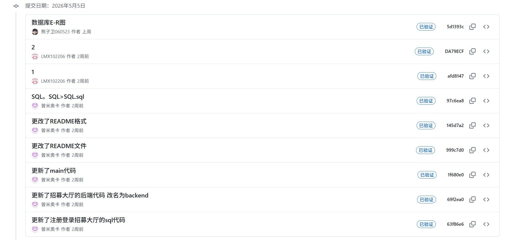

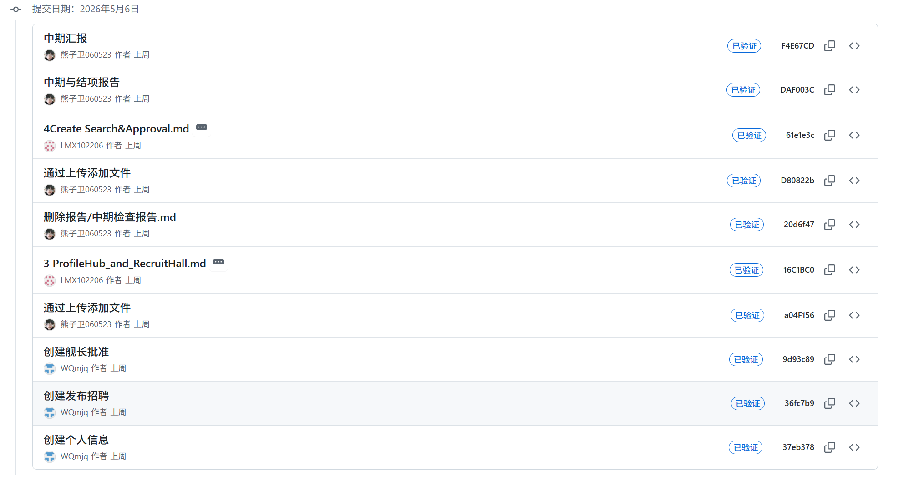

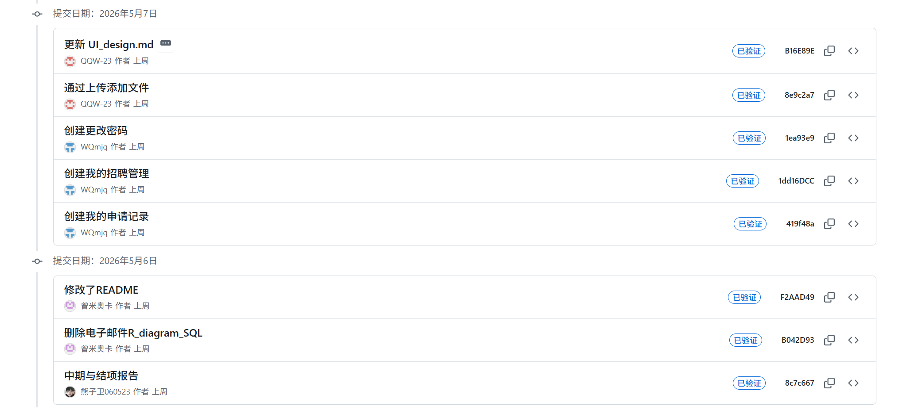

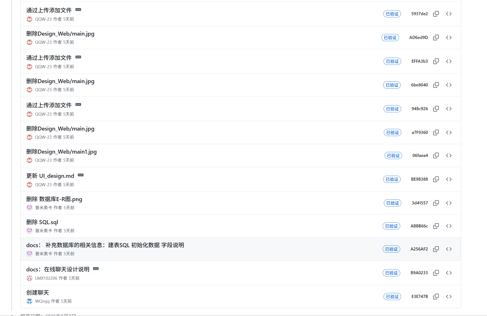

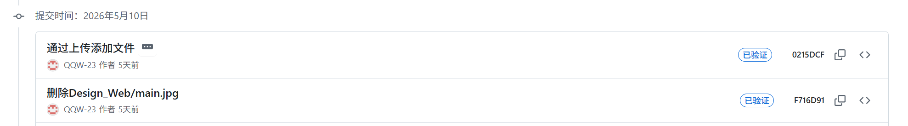

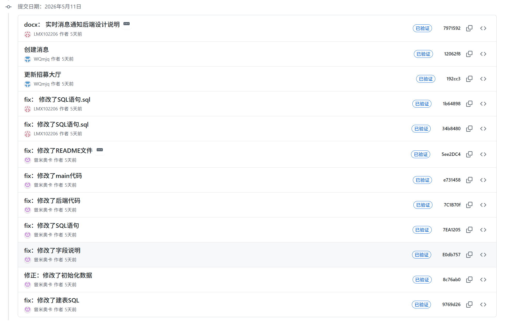

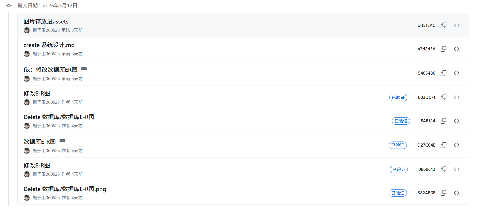

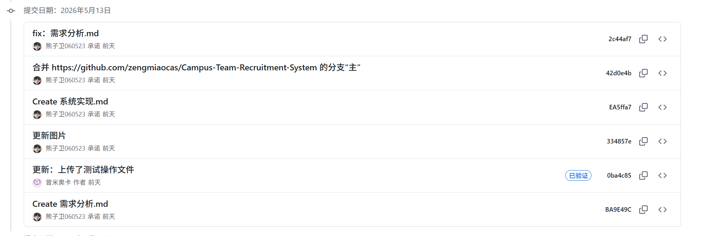

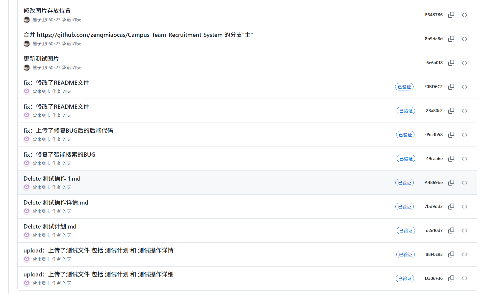

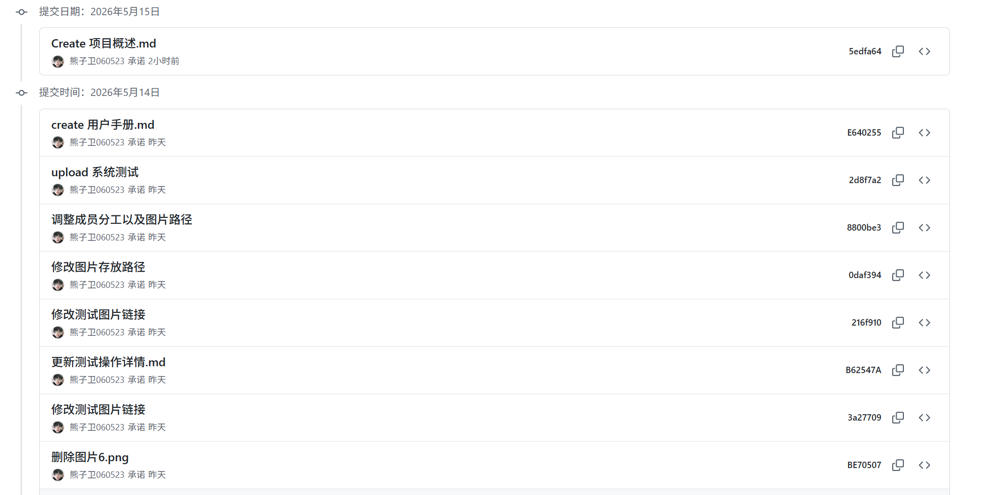

---

## 附录

### 参考资料

- [FastAPI官方文档](https://fastapi.tiangolo.com)
- WebSocket协议规范：RFC 6455
- [SQLite官方文档](https://www.sqlite.org/docs.html)
- [TailwindCSS官方文档](https://tailwindcss.com)
- [Marked.js文档](https://marked.js.org)

### 源代码仓库链接

- GitHub仓库：https://github.com/zengmiaocas/Campus-Team-Recruitment-System

### 其他补充材料

- **测试计划书**：详见项目文档 `测试计划书.docx`
- **测试操作详情**：详见项目文档 `测试操作详情.docx`
- **部署说明**：详见第六章《用户手册》安装部署说明

---

> **文档版本**：v2.0（结项版）
> **最后更新**：2026年5月16日
> **项目名称**：校园组队招募系统
